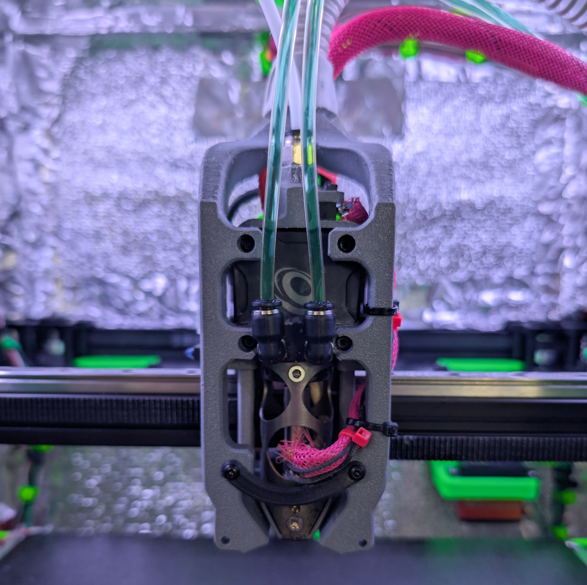

# Wishbone Toolhead

A toolhead for RatRig V-Core 3.1 printers that supports the Chube Conduction hotend and LGX Pro extruder. 
The CPAP Ducts kind of look like a wishbone.

## General

The main goal of this was to be able to run a Chube Conduction hotend
with water cooling on a RatRig V-Core 3.1. 
With this setup, I generally run 750mm/s and 30k accel without visible artifacts, your results may differ.

#### This is designed to work with the following hardware
- Chube Conduction hotend
- Chube Conduction water block
- Bondtech LGX Pro extruder

*This is my first complete toolhead design - feedback, testing, and contributions are very welcome!*

### Features
* LGX Pro + Chube Conduction  
* Simple installation and maintenance
* Easy belt installation
*   SLM body
*   Minimal X/Y loss
* CPAP integration
* Beacon support
*   2 unused m3 heat insert points on the CPAP ducts for adding accessories (cameras)

Note - *I would not run this unless you have an AWD setup - it's decently heavy at ~580g fully loaded*

## Printing

### FDM Printing

#### What to Print (in the STL dir)

- Beacon Mount.3mf
- CPAP Brace.3mf
- CPap Ducts.3mf
- EBB42 Mount.3mf
- X-Endstop Mount.3mf
- LGX Pro filament sensor.3mf (if you want to use one)

##### Print Settings

- Walls: 5
- Infill: 50%
- Material: ASA/ABS if enclosed, whatever you want if open-air
  - I would print the ducts and duct brace out of ASA or ABS, they're pretty close to the hotend and get a bit toasty.

### SLM Printing

- This toolhead is designed to be printed in aluminum (SLM). PCBWay or in3dtec are good places to go.
- There are M3 threads in this design - the PDFs should be used to tell them how to tap them, or you can do it yourself.

#### What to Print (in the SLM dir)

- Bottom Toolhead Plate.step
- LGX Pro + Chube Conduction SLM Plate.step
- Upper-lower plate joiner (L).step
- Upper-lower plate joiner (R).step

## My V-Core 3.1 Setup

-  Power: 48v XY
- Front motor mounts: BRS Engineering AWD + tensioner mod
- Rear motor mounts: Funssor aluminum motor mounts
- Motors: Kraken V2 Motors x4 (decoupled)
- Gantry: Mitsumi 2020 extrusion
- X/Y Rails: Z1 preload rails from KB3D
- XY Joiners: Funssor aluminum XY joiners

## Happy printing!

*This is licensed under [CC BY-NC 4.0](https://creativecommons.org/licenses/by-nc/4.0/)*

